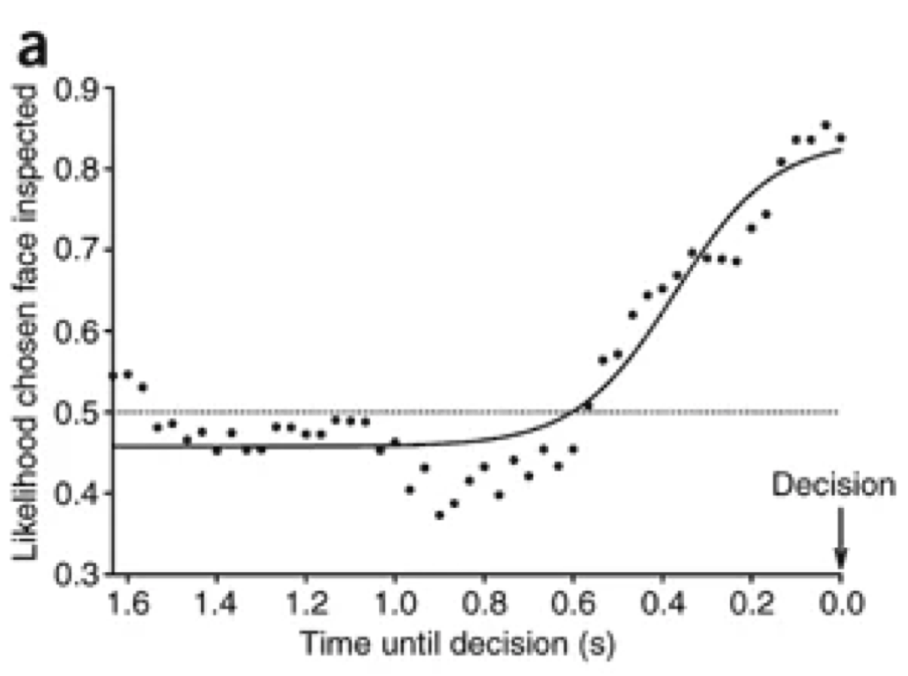
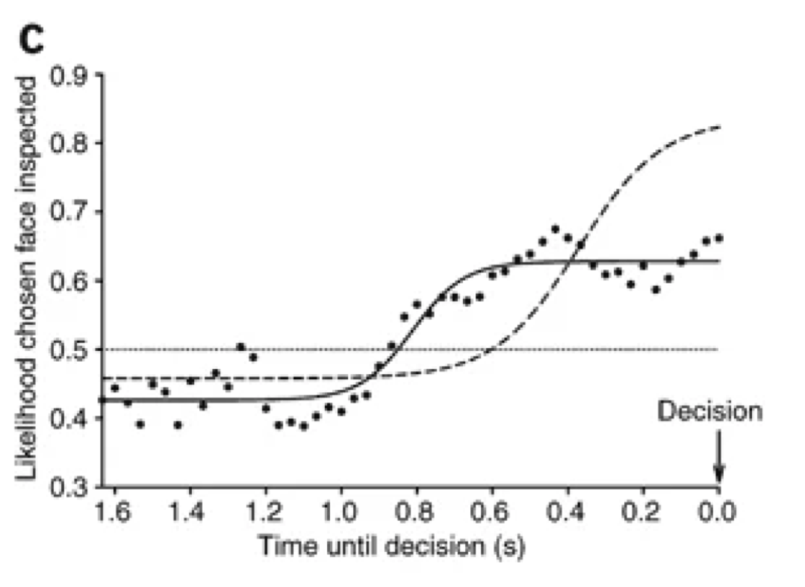

```{r E5 load libraries, include=FALSE}
library(dplyr)
library(tidyr)
library(jsonlite)
library(ggplot2)
library(knitr)
```

```{r E5 load all data, include=FALSE}
data.files <- list.files('data', full.names = TRUE)
data.tables <- lapply(data.files, function(file){
  data.table <- fromJSON(file)
  data.table$response <- as.character(data.table$response)
  return(data.table)
})
all.data <- bind_rows(data.tables)
```

```{r}
# Excluding Subjects (AJ: why/how? I can't figure it out, so I'm putting them back in)
# all.data <- all.data %>% filter(subject_id!="603ea6a51c38def3e4140ba6" & subject_id!="5ce1372c55fe0d001869c8d8" & subject_id!="5f47d860b56e68220cb86be1" & subject_id!="607eaf87ac02229ef4fa8f4a" & subject_id!="5d30857eb2f0ad00163470f3" & subject_id!="5e272684f205790453c2c4b8" & subject_id!="5f5b5881b17fa72756b8ff2a" & subject_id!="5fae5291ec402509e2885604")
# E5.excluded.n = 8

#There's an issue with Subject 603ea6a51c38def3e4140ba6: their webgazer_data is a list of length 0 instead of a dataframe like the others.
all.data <- all.data %>% filter(subject_id!="603ea6a51c38def3e4140ba6")


# Convert data to long format for gaze measurements
task.data <- all.data %>%
  filter(response=="a" | response=="d") %>%
  select(subject_id, study_id, time_elapsed, trial_index, response, rt, webgazer_data, webgazer_targets) %>%
  unnest(webgazer_data) %>%
  tidyr::unpack(webgazer_targets) %>%
  tidyr::unpack(c('#face1', '#face2'), names_sep = ".")

# Code condition information
task.data <- task.data %>%
  mutate(task = if_else(study_id == '60748d36577623e2677865c6', "Attractiveness", "Roundness"))

# restrict to time points 1 sd before the decision
rt.summary <- all.data %>%
  filter(response=="a" | response=="d") %>%
  select(subject_id, study_id, trial_index, response, rt) %>%
  summarize(M=mean(rt), SD=sd(rt))
task.data <- task.data %>%
  mutate(time_until_decision = rt - t) %>%
  filter(time_until_decision <= rt.summary$SD)

# Bin in 50 ms bins (not 30 as in the original study, because we are using webcams)
task.data <- task.data %>%
  mutate(time.window = floor(time_until_decision/50)*50+25) #make sure bin is centered


```

Due to large variation in response time latency, Shimojo and colleagues analyzed eye gaze for the 1.67 seconds prior to the response. This duration was one standard deviation of the mean response time, ensuring that all timepoints analyzed have data from at least 67% of trials. In our dataset, one standard deviation amounts to `r round(rt.summary$SD/1000, 2)` seconds. We then binned eyegaze data into 50 ms bins rather than the 30 ms bins used by Shimojo and colleagues, reflecting the different sampling rates.

```{r importdat, echo=FALSE, warning=FALSE, include=FALSE}
# define ROIs
in.box <- function(x, y, left, right, top, bottom, padding){
  is.in.the.box <- x >= left - padding & x <= right + padding & y >= top - padding & y <= bottom + padding
  return(is.in.the.box)
}

#analyze with respect to ROIs
task.data <- task.data %>%
  mutate(in.left.box = in.box(x,y,`#face1.left`,`#face1.right`,`#face1.top`,`#face1.bottom`,0)) %>%
  mutate(in.right.box = in.box(x,y,`#face2.left`,`#face2.right`,`#face2.top`,`#face2.bottom`,0)) %>%
  mutate(in.target.box = if_else(response == 'a', in.left.box, in.right.box)) %>%
  mutate(in.other.box = if_else(response == 'a', in.right.box, in.left.box))

summary.gaze.view <- task.data %>%
  filter(in.target.box == TRUE | in.other.box == TRUE) %>%
  group_by(subject_id, time.window, task) %>%
  summarize(prop.in.target.subject = mean(in.target.box)) %>%
  group_by(time.window, task) %>%
  summarize(prop.in.target = mean(prop.in.target.subject), se = sd(prop.in.target.subject)/sqrt(n()))

# Two-sample Kolmogorov-Smirnov test
KS<-ks.test(summary.gaze.view %>% filter(task == "Attractiveness") %>% pull(prop.in.target),
         summary.gaze.view %>% filter(task == "Roundness") %>% pull(prop.in.target))


# Fitting a sigmoid as described in original

sigmoid<-function(x, a, b, c, d){
  return(d + (a - d) / (1 + (x / c)^b))
}

error <- function(x,y, pars){
  a <- pars[1]
  b <- pars[2]
  c <- pars[3]
  d <- pars[4]
  sum(sapply(1:length(x), function(i){
    return(y[i] - sigmoid(x[i], a, b, c, d))
  })^2)
}

fitsig<-function(x, y){
  pars <- c(0,0,200,0)
  return(optim(pars, fn=function(pars){error(x,y,pars)}, method="Nelder-Mead"))
}

fit.A <- fitsig(summary.gaze.view$time.window[summary.gaze.view$task=="Attractiveness"], summary.gaze.view$prop.in.target[summary.gaze.view$task=="Attractiveness"])
fit.R <- fitsig(summary.gaze.view$time.window[summary.gaze.view$task=="Roundness"], summary.gaze.view$prop.in.target[summary.gaze.view$task=="Roundness"])

fit.A.dat<-data.frame(x=summary.gaze.view$time.window[summary.gaze.view$task=="Attractiveness"], y=sigmoid(summary.gaze.view$time.window[summary.gaze.view$task=="Attractiveness"], fit.A$par[1], fit.A$par[2], fit.A$par[3], fit.A$par[4]))

fit.R.dat<-data.frame(x=summary.gaze.view$time.window[summary.gaze.view$task=="Roundness"], y=sigmoid(summary.gaze.view$time.window[summary.gaze.view$task=="Roundness"], fit.R$par[1], fit.R$par[2], fit.R$par[3], fit.R$par[4]))

# calculate R^2
R2 <- function(fit, y){
  return(1 - fit$value / sum((y - mean(y))^2))
}
R2.A<-R2(fit.A, summary.gaze.view$prop.in.target[summary.gaze.view$task=="Attractiveness"])
R2.R<-R2(fit.R, summary.gaze.view$prop.in.target[summary.gaze.view$task=="Roundness"])

plot.A<-ggplot(summary.gaze.view[summary.gaze.view$task=="Attractiveness",], aes(x=time.window, y=prop.in.target))+
  geom_point(color="red") + 
  geom_line(data=fit.A.dat, aes(x=x, y=y), color="red", lwd=1.25, linetype = "solid") + 
  scale_x_reverse() + theme_classic() + 
  labs(x="Time until decision (ms)", y="Proportion of gaze in target", color="Task", fill="Task") + ylim(.4, 1)

plot.R<-ggplot(summary.gaze.view[summary.gaze.view$task=="Roundness",], aes(x=time.window, y=prop.in.target))+
  geom_point(color="turquoise4") + 
  geom_line(data=fit.A.dat, aes(x=x, y=y), color="red", lwd=1.25, linetype = "dashed") + 
  geom_line(data=fit.R.dat, aes(x=x, y=y), color="turquoise4", lwd=1.25, linetype = "solid") + 
  scale_x_reverse() + theme_classic() + 
  labs(x="Time until decision (ms)", y="Proportion of gaze in target", color="Task", fill="Task") + ylim(.4, 1)

```


(ref:groupEMain-caption) Primary results from Exp. 5. *Top* shows the original results from Shimojo and colleagues (Figures reprinted with permission[TODO]). The attractiveness judgment along with the best-fitting sigmoid  is shown in the *top left*. Results for the roundness judgment are show in the *top right*, with the best-fitting sigmoid for the attractiveness judgment depicted in a dashed line for comparison (*top right*). (*Bottom*) shows the analogous results from the replication, with the attractiveness judgments on the *bottom left* and the roundness judgments on the *bottom right*. Again, the best-fitting sigmoid for the attractiveness judgments are plotted with a dashed line alongside the roundness results, for purposes of comparison.

```{r groupEMain, fig.show="hold", out.width="45%", echo=FALSE, message=FALSE, warning=FALSE, fig.cap="(ref:groupEMain-caption)"}
# All defaults


plot.A
plot.R
```

Following Shimojo and colleagues, data for each condition were fit using a four-parameter sigmoid (Fig. \@ref(fig:groupEMain)). These fit less well than in the original paper for both the attractiveness judgment (R^2^ = `r round(R2.A,2)` vs. 0.91) and the roundness judgment (R^2^ = `r round(R2.R,2)` vs. 0.91). 

From these curves, Shimojo and colleagues focus on two qualitative findings. First, they note a higher asymptote for the attractiveness discrimination task relative to roundness discrimination. Qualitatively, this appears to replicate. However, their statistical analysis -- a Kolmogorov-Smirnov test for distance between two distributions -- is not significant (D = `r round(KS$statistic, 2)`, p = `r round(KS$p.value, 2)`), though it should be noted that this is a very indirect statistical test of the hypothesis and probably not very sensitive.

The second qualitative finding they note is that the curve for the roundness judgment "saturates" (asymptotes) earlier than the curve for the attractiveness judgment. They do not present any statistical analyses, but it is clear qualitatively that the result does not replicate. 


