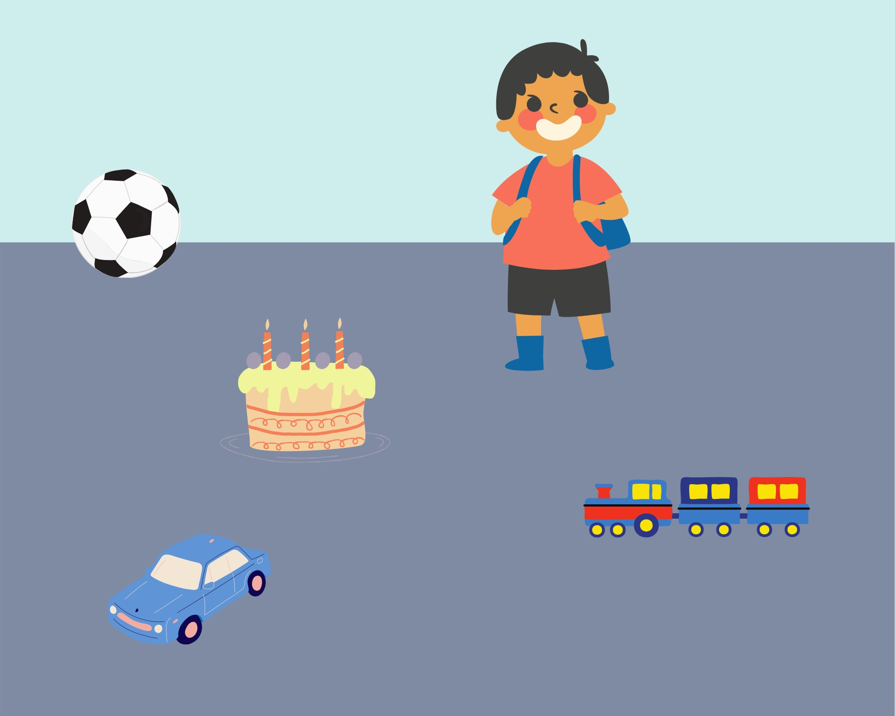
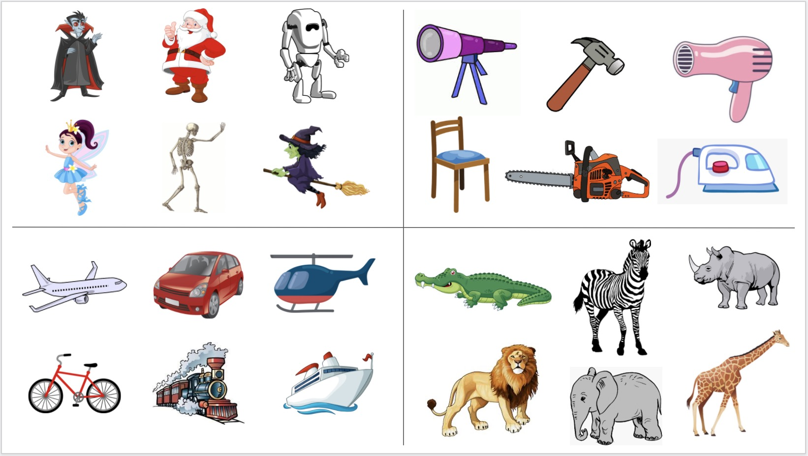
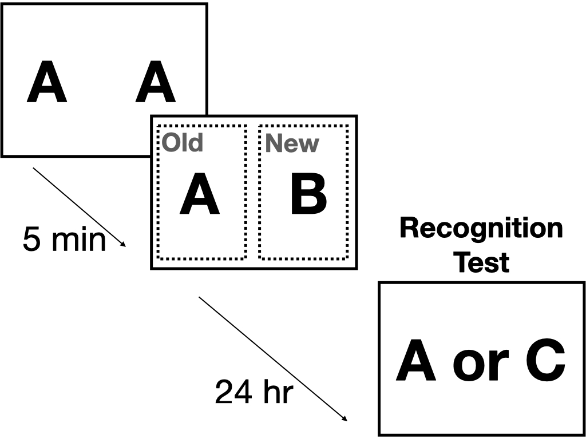
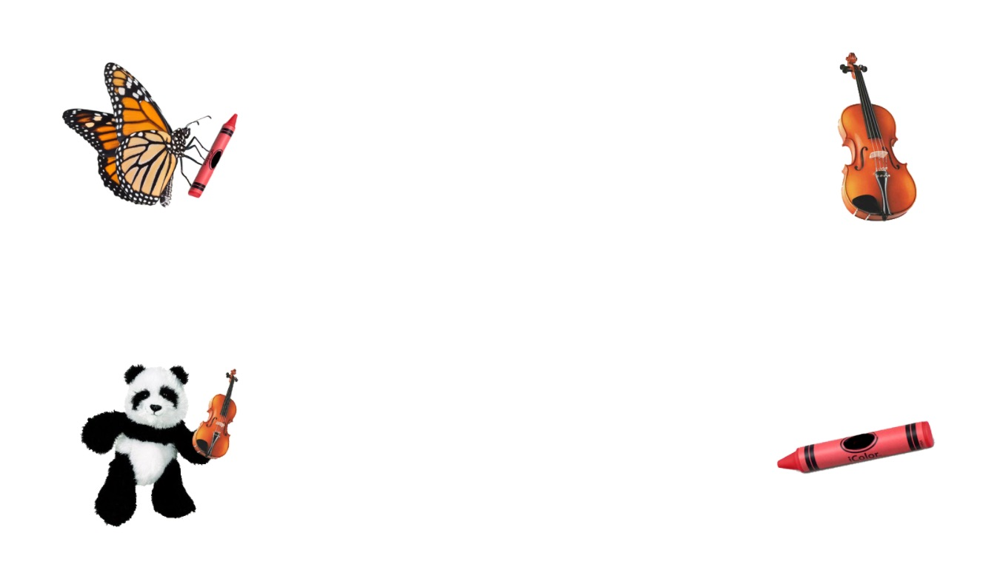
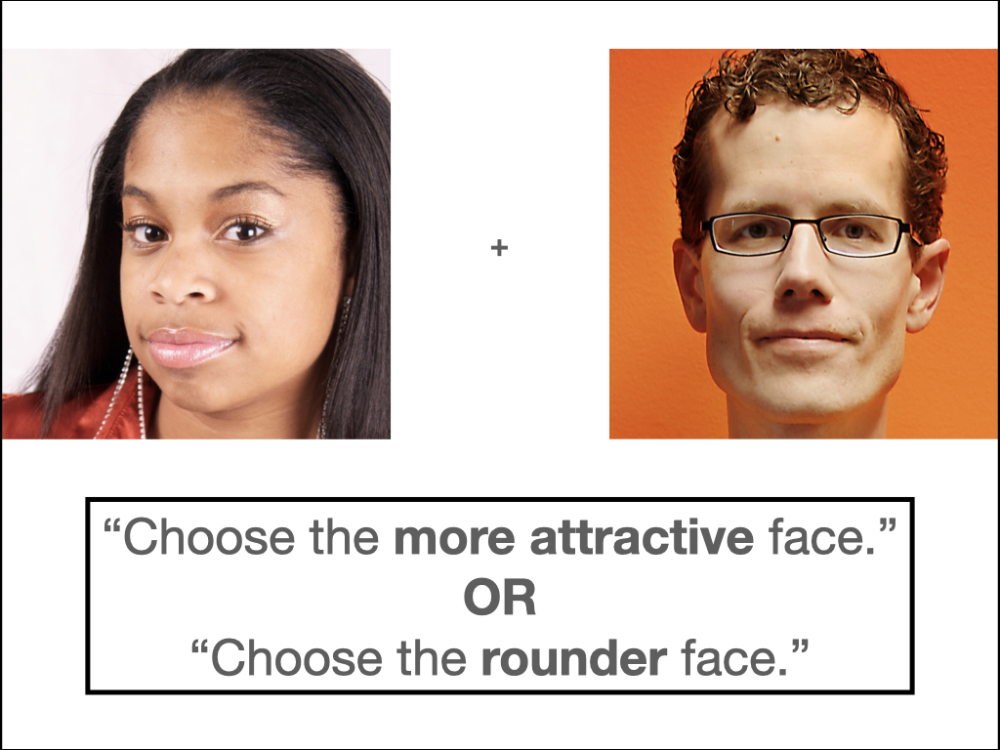

```{r setup, include = FALSE, message=FALSE, warning=FALSE}
knitr::opts_chunk$set(echo = FALSE)
library(papaja)
library(jsonlite)
library(dplyr)
library(readr)
library(tidyr)
library(ggplot2)
library(stringr)
library(lmerTest)
library(afex)
library(forcats)
library(broom.mixed)
r_refs("references.bib")

colorize <- function(x, color) { # for adding colored text (e.g., for notes to self)
  if (knitr::is_latex_output()) {
    sprintf("\\textcolor{%s}{%s}", color, x)
  } else if (knitr::is_html_output()) {
    sprintf("<span style='color: %s;'>%s</span>", color,
      x)
  } else x
}

#3 digits for p-values
options(papaja.precision = list(p_value = 3))
```

```{r analysis-preferences}
# Seed for random number generation
set.seed(42)
knitr::opts_chunk$set(cache.extra = knitr::rand_seed)
```

The use of eye-tracking to study cognition took off when Alfred Yarbus used suction cups to affix a mirror system to the sclera of the eye in order to monitor eye position during the perception of images [@yarbus1967eye]. In one study, participants viewed a painting depicting multiple people in a complex interaction inside of a 19th century Russian home. Yarbus showed, among other things, that the scan paths and locations of fixations were largely dependent on the instructions given to participants (e.g., View the picture freely vs. Remember the position of the people and objects in the room). In other words, the cognitive processing that the individual is engaged in drives the visuo-motor system. Since these findings, eye-tracking has become a central method in cognitive science research [for reviews see @hayhoe2005eye; @richardsonEyeTrackingResearch2004; @rayner1998eye]. For example, gaze location during natural scene perception is used to test theories of visual attention [e.g., @henderson2017meaning], and eye-movements during auditory language comprehension, using the "visual world paradigm," demonstrated the context-dependent and incremental nature of language processing [e.g., @tanenhaus1995].

An important limitation of the eye-tracking methodology is that it has typically required costly equipment (eye-trackers can range in price from a few thousand dollars to tens of thousands of dollars), particular laboratory conditions (a quiet room with consistent indoor lighting conditions), and a substantial time investment (e.g., bringing participants into a laboratory one at a time). This limits who can conduct eye-tracking research -- not all researchers have the necessary resources -- and who can participate in eye-tracking research. Most eye-tracking study participants are from western, educated, industrialized, rich, and democratic [WEIRD, @henrich2010weirdest] convenience samples [but see @ryskin2023real], which diminishes the generalizability of the findings and the scope of conclusions that can be drawn about human cognition. Likewise, the sample sizes for in-lab experiments are usually orders of magnitude smaller than what statisticians recommend [@nosek2022replicability].

A robust solution to all these problems is online experiments, particularly with volunteer citizen scientists as participants [@li2024developmental; @hartshorne2019thousand; @reinecke2015labinthewild; @gosling2010wired]. Historically, this option has not been available for eye-tracking, since few potential subjects have expensive eyetrackers at home. In principal, this could be circumvented by using so-called "poor-man's" eye-tracking, in which researchers videotape the subject's face and code eye position frame-by-frame [@snedeker2003using]. Most computers now have high-quality built-in cameras, so recording video is straightforward. Unfortunately, coding images frame-by-frame is extremely time-intensive, making large-sample studies unrealistic. However, in recent years, image analysis has improved to the point where this work can be automated with reasonable accuracy [@papoutsaki2016webgazer; @zheng2018rapid; @burton2014comparison; @skovsgaard2011evaluation]. Nonetheless, webcam-based eyetracking only started to be used regularly in research with the advent of `Webgazer.js` [@papoutsaki2016webgazer], a webcam-based Javascript plug-in that works in the browser and which can be integrated with any Javascript web interface, including `jsPsych` [@deleeuwJsPsychJavaScriptLibrary2015], `Gorilla` [@anwyl2020gorilla], or `lab.js` [@henninger2021lab].

Given the potential game-changing nature of webcam-based eye-tracking, a number of research groups have investigated how well it works. Nearly all this work has used `Webgazer.js` --- most in combination with jsPsych, but some with Gorilla or hand-built integrations. There are two potential limitations to webcam-based eye-tracking. First, the spatial and temporal resolution is less than what is achievable with an infrared system. This is less a limitation of webcams than a limitation of the information about eyegaze available in an image of a face. Anecdotally, researchers who use poor-man's eyetracking find it difficult to locate the gaze to anything more fine-grained than quadrants. Second, testing subjects over the Internet involves less control: subjects may be unable or unwilling to calibrate equipment, adjust lighting, etc., to the same level of precision typical of in-lab studies.  

Results to date have been encouraging. @semmelmann2018online found data quality was reasonable for fixation location and saccades in fixation, smooth pursuit, and free-viewing tasks, though data collected online through a crowdsourcing platform was slightly more variable and timing was somewhat delayed compared to data collected in the lab. Several researchers successfully replicated well-known findings from the sentence-processing literature involving predictive looks [@degen2021seeing; @prystauka2023online; @vos2022comparing; @van2023validation]. @yang2021webcam successfully replicated a well-established link between value-based decision-making and eye gaze [see also @van2023validation]. 

While promising, there are some salient limitations. First, many of the studies report effects that are smaller or later than what had been previously observed in the lab [@slim2022moving; @degen2021seeing; @van2023validation]. Importantly, accurate timing on a web browser is not trivial [@passell2021cognitive; @de2016psychophysics], and subtle programming choices can significantly affect the accuracy of `WebGazer.js` timing [@yang2021webcam].^[See also discussion at https://github.com/jspsych/jsPsych/discussions/1892] Since most of the prior work did not address these timing issues, it is not clear how many of the reported lab/web differences would resolve.

Second, prior work has focused on studies with relatively coarse-grained regions of interest [but see @semmelmann2018online], dividing the screen either in half or in quadrants. This is particularly salient with [@prystauka2023online], which simplified @altmannIncrementalInterpretationVerbs1999's design so that regions of interest are quadrants rather than the finer-grained ROIs used in the original. Certainly, webcam eyetracking will not be as spatially fine-grained as an infrared eyetracker, but we do not yet have a good sense of the limits.

Finally, the prior work has focused on a relatively limited range of methods. Different paradigms have different technical requirements and analyze the results differently. As a result, the breadth of utility of webcam eye-tracking is unclear. 

# Present work

In order to broaden the validation of online eye-tracking methodology, we set out to reproduce five previously published studies representing a variety of questions, topics, and paradigms. The goal was to examine the strengths and weaknesses of webcam eye-tracking for common paradigms in cognitive science, across a broad range of research areas. Critically, we used the implementation known to have the greatest temporal precision to date: `jsPsych` and a modification of `Webgazer`.

## Selection of Studies

Studies with large effect sizes and which are known to replicate are ideal targets for further replication; otherwise, it can be difficult to distinguish a failure of the method from a failure of the original study to replicate. In practice, replications (successful or otherwise) have only been reported for a small number of studies, so we ultimately included some studies with unknown replicability. We addressed this in several ways. First, replicating five very different studies from different research traditions decreases our reliance on any one study. Second, we include several "sanity check" analyses, such as the correlation between calibration accuracy and effect size. If the effect is real but there is noise from low-accuracy eye-tracking, this correlation should be substantial. Third, for two of the studies, we had comparison data collected in-lab either using `jsPsych` or a more traditional eyetracker technology, allowing us to directly assess the impact of differences in subject population and equipment/setting.

We chose five high-impact eye-tracking studies involving adult subjects [for a comparison of remote WebGazer and in-lab anticipatory looking effects with 18-27 month-old participants, see @steffan2024validation]. Our goal was to include experiments from a range of topic areas (e.g., memory, decision making, psycholinguistics) and paradigms (two halves of the screen, visual world paradigm with four quadrants, visual world paradigm with "naturalistic" scenes). As noted above, we had a preference for well-established findings that are known to replicate, though for sake of diversity this was not always possible. Table \@ref(tab:studies-table) provides an overview of the five studies we selected.

```{r studies-table, echo=FALSE}
studies_table <- data.frame(
  Citation = c(
    "Altmann & Kamide, 1999",
    "Johansson & Johansson, 2014",
    "Manns, Stark, & Squire, 2000",
    "Snedeker & Trueswell, 2004",
    "Shimojo et al., 2003"
  ),
  `Topic Area` = c(
    "Psycholinguistics",
    "Memory",
    "Memory",
    "Psycholinguistics",
    "Decision Making"
  ),
  `Paradigm` = c(
    "Natural Scenes",
    "Four Quadrants",
    "Two Halves",
    "Four Quadrants",
    "Two Halves"
  ),
  `Citations` = c(
    2130,
    259,
    134,
    487,
    1146
  ),
  check.names = FALSE
)

apa_table(
  studies_table,
  caption = "Studies selected for replication attempts. Citation counts based on Google Scholar (May 2024).",
  font_size = "small",
  digits = 0
)
    
```

# General Methods

All data and analysis code underlying this paper can be found in the Github repository: https://github.com/jodeleeuw/219-2021-eyetracking-analysis. The current paper is fully reproducible by rendering `manuscript.Rmd`.

## Participants

Participants completed the experiment remotely and were recruited
through the Prolific platform. In order to have access to the
experiment, participants had to meet the following criteria: 18 years of
age or older, fluency in English, and access to a webcam. All
participants provided informed consent. The online studies were approved by the
Vassar College Institutional Review Board.

In addition, an in-lab replication was conducted for Experiment 1. 
Information about the sample is given in the Experiment 1 Method sections. This study was approved by the Institutional Review Board at Boston College. 

In order to have adequate statistical power and precision, we aimed for
2.5x the sample size of the original experiment, following the heuristic
of Simonsohn [@simonsohn2015]. In Experiment 5, the original sample size was so
small that we opted to collect 5x the number of participants to increase
precision. Because of budget and time constraints we were unable to
replace the data for subjects who were excluded or whose data was
missing due to technical failures.

## Equipment

We used a fork of the `webgazer.js` library for webcam eye-tracking
[@papoutsaki2016webgazer], implemented in `jsPsych`, a Javascript
library for running behavioral experiments in a web browser
[@deleeuwJsPsychJavaScriptLibrary2015]. Our fork included changes to
`webgazer.js` in order to improve data quality for experiments in which
the precise timing of stimulus onsets is relevant. Specifically, we
implemented a polling mode so that gaze predictions could be requested
at a regular interval, which improved the sampling rate considerably in
informal testing. This modification is similar to what Yang and Krajbich
[-@yang2021webcam] reported improved the sampling rate in their study of
webgazer. We also adjusted the mechanism for recording time stamps of
each gaze prediction, so that the time stamp reported by webgazer is
based on when the video frame is received and not when the computation
of the gaze point is finished.

## Eye-tracking Calibration and Validation

<!--took paragraph below from group D's methods -->

When participants began the experiment, they were notified the webcam
would be used for eye tracking but no video would be saved. They were
asked to remove glasses if possible, close any other tabs or apps, turn
off notifications, and make sure their face was lit from the front. The
webcam's view of the participant popped up on the screen, and
participants were asked to center their face in the box and keep their
head still. The experiment window then expanded to full screen, and
participants began the eye-tracking calibration.

During the calibration, dots appeared on the screen one at a time in
different locations, and the participants had to fixate them and click
on each one. Once they clicked on a dot, it would disappear and a new
one would appear in a different location on the screen. The locations of
calibration dots were specific to each experiment (details below) and
appeared in the areas of the screen where the visual stimuli would
appear during the main task in order to ensure that eye movements were
accurately recorded in the relevant regions of interest. After the
calibration was completed, the validation began. Participants were asked
to go through the same steps as the calibration, except that they only
fixated the dots as they appeared in different locations on the screen.
If accuracy on the validation was too low (fewer than 50% of looks
landed within a 200 px radius of the validation points),
participants were given an opportunity to re-start the calibration and
validation steps. <!--If the second attempt also lead to low validation
accuracy, participants were informed that they could not participate in
the study.(AJ: I don't think this is true, as there are Ps included that have under 50% on the second round of calibration)-->

## Pre-registration

These data were collected within the context of an undergraduate research methods course. Groups of students (co-authors) designed and programmed experiments in jsPsych, pre-registered their planned analyses, and collected data through Prolific under the supervision of the last author. The OSF repositories associated with these experiments are linked in the methods sections of each individual study. Note that in the current paper we expand on those pre-registered analyses (e.g., including analyses of the calibration quality). 

## Data Pre-processing

We used `r cite_r("references.bib")` for our analyses.

# Experiment 1a

<!-- group a -->

The first study was a replication attempt of
@altmannIncrementalInterpretationVerbs1999. Altmann and Kamide used the
visual world eye-tracking paradigm [@tanenhaus1995] to show that
meanings of verbs rapidly constrain the set of potential subsequent
referents in sentence processing. For example, when looking at the
display in Figure\ \@ref(fig:E1-example-trial) and listening to a sentence like
"The boy will eat the...," participants are more likely to look at the cake than 
when they hear "The boy will move the...," in which case they tend to look at the
train, presumably because cakes are edible and trains are not. Semantic
information available at the verb is used to anticipate upcoming
linguistic input.


## Method

All stimuli, experiment scripts, data, analysis scripts, and a
pre-registration are available on the Open Science Framework at
<https://osf.io/s82kz>.

### Participants
Sixty participants (2.5 times the original sample of 24) were paid \$2.60 for their participation. For unknown reasons,
2 of the subjects' results were not recorded, so in the analysis, we
worked with data collected from 58 participants.


### Materials and Design

The visual stimuli were created through Canva and depicted an agent
accompanied by four to five objects in the scene (see Figure\ \@ref(fig:E1-example-trial)). On
critical trials, participants heard one of two sentences associated with
the scene. In the restrictive condition, the sentence (e.g., "The boy
will eat the cake") contained a verb (e.g., "eat") which restricts the
set of possible subsequent referents (e.g., to edible things). Only the
target object (e.g., the cake) was semantically consistent with the
verb's meaning. In the non-restrictive condition, the sentence (e.g.,
"The boy will move the cake") contained a verb (e.g., "move") which does
not restrict the set of possible subsequent referents. The target object
(e.g., the cake) as well as the distractor objects (e.g., the train, the
ball, etc.) were semantically consistent with the verb's meaning. Both
sentences were compatible with the scene, such that the correct keyboard
response for the critical trials was "yes." Filler trials consisted of
scenes that also contained an agent surrounded by objects as in the critical trials, but corresponding sentences named an object that was not present in the scene. The correct keyboard response for the filler
trials was "no."

```{r E1-example-trial, fig.cap='Example trial from Experiment 1. Participants would hear a sentence (e.g., "The boy will eat the cake") and respond according to whether the sentence matched the picture.', out.width="50%", fig.align="center"}

```


Each participant was presented with 16 critical trials (eight in
the restrictive condition, eight in the non-restrictive condition) and
16 fillers for a total of 32 trials. The order of trials and the
assignment of critical scene to condition was random on a
subject-by-subject basis.<!-- right?-->

### Procedure


```{r E1 calibration figure, child = 'group-a/E1-calibration-figure.Rmd', out.width="50%", fig.align="center" }

```

```{=html}
<!-- Qs: 
-keyboard keys? what was the exact phrasing of the instruction? 
-Any delay between when visual scene appears and the audio starts? 
-Does trial end as soon as participant responds?-->
```

## Results
Looks to the objects in the scene were time-locked to the onset of the
verb, the offset of the verb, onset of the post-verbal determiner, and
onset of the target noun. ROIs were defined by creating boxes around each object in the scene. The size of each box was determined by taking the height and width of the given object and adding 20 pixels of padding. Each scene contained an agent region, a target region, and three or four distractor regions.

```{r E1-analysis-replication, child = 'group-a/E1-analysis-replication.Rmd'}

```

## Discussion
Across three different tests of the hypothesis that listeners will use verb semantics to anticipate the upcoming referent, we found results that were numerically consistent with the hypothesis but not statistically significant. This is unlikely to be because the original effect is unreliable. Indeed, one of us had successfully replicated it previously using traditional methods [@james2023language]. 

An eyeball comparison to published data [@altmannIncrementalInterpretationVerbs1999, @james2023language] suggests that looks to the objects in the scene (relative to background or off-screen looks) were depressed across conditions and objects. After eliminating participants with validation accuracy under 50% and/or 10% or fewer fixations to any ROIs, we were left with only 22 of the original 60 participants. Either of these facts could have resulted in low power to detect effects. Given that nearly two-thirds of participants had poor data quality, we ran a follow-up webcam study in a lab setting order to test whether the failure to replicate was due to using a remote sample or to the technology itself.

# Experiment 1b
Experiment 1b tested whether the failure to replicate significant condition effects in Experiment 1a was due to features of conducting the study remotely (i.e. varied experimental settings and apparatuses, lower compliance) rather than webcam-based eye-tracking or `webgazer` _per se_. Thus, Experiment 1b took place in a lab setting with undergraduate participants but otherwise used the same Method as Experiment 1a. 

## Method

### Participants
Forty-nine participants completed the study in a lab setting. They were recruited via the Boston College subject pool. Participants needed to be 18 years of age or older and native speakers of English.

### Materials and Design
Materials were identical to those in Experiment 1a.

### Procedure
After being greeted by the experimenter and completing the informed consent form, participants followed on-screen prompts to complete the study, including calibration, as described in the Experiment 1a Procedure. 

### Apparatus
Subjects were tested on a MacIntosh laptop using the built-in Webcam. The study was run in Chrome using the same code as Exp. 1a. 

## Results
```{r E1-analysis-JoshH-lab, child = 'group-a/E1-analysis-comparison-to-Hartshorne.Rmd'}

```

## Discussion
Overall, the results of Experiment 1 paint a sobering picture of web-based eye-tracking. In Experiment 1a, results from the remote sample were in the expected direction but effects were smaller and delayed relative to previous work and failed to reach statistical significance. This was not due to vagaries of remote samples or working with a more diverse subject population: results from the in-lab study were, if anything, worse. Nor does our failure to replicate seem to be driven by subjects with poor calibration; effect sizes were not correlated with calibration success, and restricting analyses to subjects with good calibration scores only helped in one of the experiments and in only one of the three critical analyses.

Taken together, the instability of these effects might suggest that this paradigm is not well-suited for webcam-based eye-tracking. Notably, the ROIs were tightly drawn around the five to six objects in each scene (drawing larger ROIs in these scenes would have led to overlapping objects) and thus, analyses were unforgiving of inaccurate calibration. Further evidence comes from a recent `webgazer` study that successfully replicated the original results using modified stimuli consisting of only four objects, each in separate quadrants, allowing for larger, more distinct ROIs [@prystauka2023online]. 

The next four experiments test paradigms with more generous ROIs.

# Experiment 2

<!-- group b -->

The second study was a replication attempt of @johanssonLookHereEye2014,
which examined how visuospatial information is integrated into memory
for objects. They found that, during memory retrieval, learners
spontaneously look to blank screen locations where pictures were located
during encoding [see @spiveyOculomotorMechanismsActivated2001] and that
this spatial reinstatement facilitates retrieval of the picture.

## Method

All stimuli, experiment scripts, data, analysis scripts, and a
pre-registration are available on the Open Science Framework at
<https://osf.io/xezfu/>.

### Participants

Sixty participants were paid for their participation (once again, 2.5x larger than the original sample size of 24). 
Data from one participant were not properly
recorded due to unknown technical issues, so data from 59 participants
were included in all analyses to follow.

### Materials and Design

The experiment consisted of two blocks each composed of an encoding
phase and a recall phase. The two blocks differed by whether the recall phase was in the free-viewing or fixed-viewing condition, as described in the Procedure. Participants were randomly assigned to see the
fixed-viewing or free-viewing block first. 
During each encoding phase, participants saw a
grid indicating the four quadrants of the screen. Each quadrant
contained six cartoon images of items belonging to the same category. The four categories were humanoids, household objects, animals, and
methods of transportation (see Figure\ \@ref(fig:E2-example-trial)). Different images were used in each block; there were 48 unique images total across the experiment. 

Each recall phase presented participants with a blank screen with a central fixation cross as they listened to true/false statements testing their recall of the previous grid. Each statement fell into either an interobject or intraobject
condition. Interobject statements were those that compared two different
items in the grid (e.g. "The skeleton is to the left of the robot"),
while intraobject statements were those that asked about the orientation
of a single item (e.g. "The bus is facing right"). There were 48 total
statements in each block, such that each object was the subject of both an intraobject and an intraobject statement; there were 96 unique statements total across the experiment.

```{r E2-example-trial, fig.cap='Example trial from Experiment 2.', out.width="50%", fig.align="center"}

```

### Procedure


```{r E2 calibration figure, child='group-b/E2-calibration-figure.Rmd', out.width="50%", fig.align="center"}

```

Participants received instructions that included an example grid and an explicit request that they not use any tools to help them during encoding. Participants then began their first encoding phase. Each of the four quadrants was presented one at a time. First, a list of
the items in the quadrant was shown, then the pictures of items were displayed in the quadrant. 
For each item, participants used their arrow keys to indicate whether the object was facing left or right. After the participant identified the direction of each
item, they would have an additional 30 seconds to encode the name and
orientation of each item in the quadrant. Finally, after all four quadrants
were presented, participants were shown the full grid of
24 items and had 60 seconds to further encode the name and orientation
of each item.

Participants then entered the first recall phase, in which they listened to the 48 statements and
responded by pressing the 'F' key for false statements and 'T' for true
ones. While listening to these statements, in
the free-viewing block, participants saw a blank screen and were allowed
to freely gaze around the screen. During the fixed-viewing block,
participants were asked to fixate a small cross in the center of the
screen throughout the recall phase. In both cases, the mouse was
obscured from the screen. 

Participants then proceeded to the second encoding and recall phases as described above. After completing both encoding-recall blocks, participants were asked to
answer a few survey questions (such as whether they wore glasses or
encountered any distractions).

The primary methodological difference between this replication and
Johansson and Johansson's study was that the original study included two
additional viewing conditions that were omitted from this replication
due to time constraints. In those two conditions, participant were
prompted to look to a specific quadrant (rather than free viewing or
central fixation) which either matched or mismatched the original
location of the to-be-remembered item.

## Results

```{r E2-analysis-replication, child='group-b/E2-analysis-replication.Rmd'}

```

### Calibration

```{r E2-analysis-calibration, child='group-b/E2-analysis-calibration.Rmd'}

```

### Survey results

```{r E2-analysis-survey, child='group-b/E2-analysis-survey.Rmd'}

```

## Discussion

We replicated the key eyetracking result: As in @johanssonLookHereEye2014 and @spiveyOculomotorMechanismsActivated2001, during memory retrieval, learners spontaneously look to blank screen locations where pictures were located
during encoding, suggesting that visuospatial information is integrated into the memory
for objects. Interestingly, we did not replicate the behavior result: a memory benefit, in terms of speed, of spatial reinstatement via gaze position during retrieval of the picture. For researchers interested in that effect, this is an issue to be followed up on. However, it is not strictly relevant for our evaluation of gaze tracking online.

# Experiment 3

<!-- group c -->

The third study was a partial replication attempt of the "looking group" condition of
@mannsVisualPairedcomparisonTask2000 (we did not replicate their priming condition). This experiment used the visual
paired-comparison, which involves presenting a previously-viewed image
and novel image together and measuring the proportion of time spent
looking at each image. The expected pattern of results is that
participants will look more at novel objects. They
@mannsVisualPairedcomparisonTask2000 hypothesized that this pattern of
behavior could be used to measure the strength of memories. If a viewer
has a weak memory of the old image, then they may look at the old and
new images roughly the same amount of time. They tested this in two
ways. First, they showed participants a set of images, waited five
minutes, and then paired those images with novel images. They found that
participants spent more time (58.8% of total time) looking at the novel
images. They then measured memory performance one day later and found
that participants were more likely to recall images that they had spent
less time looking at during the visual paired-comparison task the
previous day.

## Method

The stimuli, experimental code, and data and analysis scripts can be
found on the Open Science Framework at <https://osf.io/k63b9/>.
The pre-registration for the study can be
found at <https://osf.io/48jsv> . We
inadvertently did not create a formal pre-registration using the OSF
registries tool, but this document contains the same information and is
time stamped prior to the start of data collection. <!-- Students failed
to pre-register this one and I missed it. There's an unofficial
pre-registration in the OSF site. -->

### Participants

Our pre-registered target was 50 participants. 51 participants completed
the first day of the experiment and 48 completed the second day.
Following Manns et al., we excluded 3 participants due to perfect
performance on the recognition memory test because this prevents
comparison of gaze data for recalled vs. non-recalled images. Our final
sample size was 45 participants.

### Materials and Design

Stimuli consisted of color photographs of common objects (e.g. an apple, a key, etc.). We selected 96 unique images from the stimulus set provided by @konkle2010conceptual, which contains multiple objects from hundreds of unique categories. We selected images in 48 pairs from the same object category such that each critical object had a corresponding foil object during the recognition test (e.g. one red apple and one green apple). All images are of a single object on a white background. <!-- There are 98 unique images on OSF. One pair (lighter and lighter-alternate) isn't used. -->

Stimulus sets were created to present participants with 24 presentation trials and 24 test trials on Day 1, and 48 recognition trials on Day 2. Each presentation trial screen presented two identical images (e.g. red apple and red apple). The test trial screens presented each of the previously-seen ("old") images paired with a new image (e.g. red apple and bicycle key). The recognition trial screens presented a single image that was either from the original set of 24 (seen twice across the first two phases) or was a corresponding foil for the original set (e.g. red apple or green apple). Thus, each participant was exposed to 72 unique images over the course of the experiment (the 24 foils for the "new" images in the test phase are never seen). Two full stimulus lists were created to counterbalance images across participants; the images that composed the "old" set for one list made up the "new" set for the list. The experimental design is visually depicted in Figure\ \@ref(fig:E3-design-schematic).


### Procedure


```{r E3 calibration figure, child='group-c/E3-calibration-figure.Rmd', out.width="50%", fig.align="center"}

```

The experiment was administered over the course of two
consecutive days. The presentation phase and test phase occurred on
the first day, while the recognition test occurred on the second day.

During the presentation phase, participants viewed 24 pairs of identical
images. Each pair was presented for
5 seconds and an interval of 5 seconds elapsed before the next pair was
shown. The order of the photographs was randomized and different for
each participant. After completion of the presentation phase,
participants were given a 5-minute break during which they could look
away from the screen.

After the break, they were prompted to complete the eye-tracking
calibration again before beginning the test phase. During this phase,
participants again viewed 24 pairs of photographs (old and new) with an interstimulus
duration of 5 seconds. 

Approximately 24 hours after completing the first session, with a leeway
interval of 12 hours to accommodate busy schedules, participants were
given the recognition test. Each image was shown on the screen for 1 second, followed by a
1 second interstimulus interval. Each photograph remained on the screen until the participants indicated whether or not they had seen it before by pressing 'y' for yes and 'n' for no. After they pressed one of the two keys, a prompt on the screen
asked them to rate their confidence in their answer from 1 as a "pure
guess" to 5 as "very sure." by clicking on the corresponding number on
the screen. No feedback on their responses was given during the test.

One aspect of the original study that we could not replicate was that we presented all stimuli on a single screen rather than two screens due to the constraints of the online experiment format. We had no *a priori* reason to expect this to matter.


```{r E3-design-schematic, fig.cap='Schematic of the design of Experiment 3.', out.width="35%", fig.align="center"}

```

## Results

```{r E3-analysis-replication, child='group-c/E3-analysis-replication.Rmd'}

```

### Effects of ROIs

```{r E3-analysis-ROIs, child='group-c/E3-analysis-roi.Rmd'}

```

### Calibration

```{r E3-analysis-calibration, child='group-c/E3-analysis-calibration.Rmd'}

```

## Discussion

As in @mannsVisualPairedcomparisonTask2000, participants looked more at novel images than previously seen images. This effect was consistent for ROIs based on the images and for the coarser ROIs based on two halves of the display. A day later, participants were also able to discriminate the images they had seen from foil images they had not seen during the previous session. However, there was no evidence that memory performance on day 2 was related to looking time on day 1. 

Thus, most of the key findings replicated. What should we make of the finding that failed to replicate? Notably, the proportion of looks to the novel object on Day 1 (54% or 55%, depending on analysis) was numerically smaller than in the original (59%), potentially decreasing the ability to detect correlations with eye-gaze. If so, the question is whether that is due to lower-quality eye-gaze tracking. This seems unlikely, because calibration quality did not appear to substantially affect this result (or any of the others). Alternative explanation include the well-documented decline effect (replications tend to find smaller effect sizes than the original) and the common finding that subject accuracy is lower when not testing undergraduates at elite universities.

# Experiment 4

<!-- group d -->

The fourth study was a replication attempt of Experiment 1 in
@ryskinVerbBiasesAre2017, which was closely modeled on
@snedekerDevelopingConstraintsParsing2004a. These studies used the
visual world paradigm to show that listeners use knowledge of the
co-occurrence statistics of verbs and syntactic structures to resolve
ambiguity. For example, in a sentence like "Feel the frog with the
feather," the phrase "with the feather" could be describing the frog, or
it could be describing the instrument that should be used to do the
"feeling." When both options (a frog holding a feather and a feather by
itself) are available in the visual display, listeners rely on the
verb's "bias" (statistical co-occurrence either in norming or corpora)
to rapidly choose an action while the sentence is unfolding. 
Use of the verb's bias should be reflected in a greater proportion of eye-gaze fixations to the animal (e.g., frog) for verbs that are biased toward modifier structures relative to instrument structures and, conversely, a greater proportion of eye-gaze fixations to the instrument (e.g., feather) for verbs that are biased toward instrument structures relative to modifier structures.

## Method

The stimuli, experimental code, and data and original analysis scripts can be
found on the Open Science Framework at the following link,
<https://osf.io/x3c49/>. The pre-registration
for the study can be found at <https://osf.io/3v4pg>.

### Participants

Fifty-seven participants were paid \$2.50 for their participation --- three fewer than the intended sample of 60, which was not reached due to time constraints, but double the sample in Ryskin et al. (2017) Experiment 1. 

### Materials and Design

The images and audios presented to the participants were the same
stimuli used in the original study. The critical
trials were divided into modifier-biased, instrument-biased, and
equibiased conditions, and the filler trials did not contain ambiguous
instructions. Two lists of critical trials were made with different verb
and instrument combinations (e.g., "rub" could be paired with "panda"
and "crayon" in one list and "panda" and "violin" in the second list).
Within each list, the same verb was presented twice but each time with a
different target instrument and animal. The lists were randomly assigned
to the participants to make sure the effects were not caused by the
properties of the animal or instrument images used. There were 54 critical trials per list (3 verb conditions x 9 verbs per condition x 2 presentations) and 24 filler trials. The list of the 27 verbs used, along with their verb bias norms, can be found in Appendix A of the original study.

### Procedure


```{r E4 calibration figure, child='group-d/E4-calibration-figure.Rmd', out.width="50%", fig.align="center"}

```

During a trial, four pictures were displayed (target animal, target
instrument, distractor animal, distractor instrument), one in each
corner of the screen, and participants heard an audio prompt that
contained instructions about the action they needed to act out (e.g.,
"Rub the butterfly with the crayon"; see Figure\ \@ref(fig:E4-example-trial))[^1]. Using their
cursor, participants could act out the instructions by clicking on
objects and moving them or motioning over the objects[^2]. After the
action was completed, the participants were instructed to press the
space bar which led to a screen that said "Click Here" in the middle in
order to remove bias in the eye and mouse movements from the previous
trial. The experiment only allowed the participants to move on to the
next trial once the audio was completely done playing and the mouse had
been moved over at least one object.

[^1]: In the original study, the pictures appeared one by one on the
    screen and their names were played as they appeared. We removed this
    introductory portion of the trial to save time

[^2]:  As opposed to the original study we recorded mouse movement
    instead of clicking behavior since not all of the audio prompts
    required clicking. For example, the sentence "locate the camel with
    the straw" may not involve any clicking but rather only mousing over
    the camel.

```{r E4-example-trial, fig.cap='An example of a critical trial from Experiment 4 for the sentence “Rub the butterfly with the crayon.” The butterfly is the target animal, the panda is the distractor animal, the crayon is the target instrument, and the violin is the distractor instrument.', out.width="50%", fig.align="center"}

```


## Results

```{r E4-analysis-replication, child='group-d/E4-analysis-replication.Rmd'}

```

### Calibration

```{r E4-analysis-calibration, child='group-d/E4-analysis-calibration.Rmd'}

```

### Effects of ROIs

```{r E4-analysis-ROIs, child='group-d/E4-analysis-ROIs.Rmd'}

```

## Discussion

As in @ryskinVerbBiasesAre2017 and @snedekerDevelopingConstraintsParsing2004a, listeners' gaze patterns during sentences with globally ambiguous syntactic interpretations differed depending on the bias of the verb (i.e., modifier-, instrument-, or equi-). For modifier-biased verbs, participants looked more quickly at the target animal and less at the potential instrument than for instrument-biased verbs (and equi-biased verbs elicited a gaze pattern between these extremes). This pattern was stronger for those who achieved higher calibration accuracy and when quadrant-based ROIs were used compared to image-based ROIs.

# Experiment 5

<!-- group e -->

The fifth study was a replication attempt of @shimojoGazeBiasBoth2003,
which found that human gaze is actively involved in preference
formation. Separate sets of participants were shown pairs of human faces
and asked either to choose which one they found more attractive or which
they felt was rounder. Prior to making their explicit selection,
participants were increasingly likely to be fixating the face they
ultimately chose, though this effect was significantly weaker for
roundness discrimination.

Note that Shimojo and colleagues compare five conditions, of which we
replicate only the two that figure most prominently in their
conclusions: the "face-attractiveness-difficult task" and the
"face-roundness task".

## Method

All stimuli, experiment scripts, data, and analysis scripts are
available on the Open Science Framework at [https://osf.io/eubsc/](https://osf.io/eubsc/). 
The study pre-registration is available at
[https://osf.io/tv57s](https://osf.io/tv57s).

### Participants

Fifty participants for the main task were recruited on Prolific and were
paid \$10/hour. <!-- Eight subjects, 4 from the attractiveness task group and 4 from
the roundness task group, were excluded for incorrect validations.
(They were able to proceed despite bad validation?) After this
data exclusion, we ended up with 21 participants each for the
attractiveness task and the roundness task. AJ: I can't figure out why these 8 were excluded so I'm adding them back for now--> For one subject (roundess task group), eye gaze data failed to record.<!--This was one of the excluded 8--> We ended up with 25 participants in the attractiveness condition and 24 in the roundness condition. The original sample size in Shimojo et al. (2003) was 10 participants total. 

### Materials and Design

The faces in our replication were selected from a set of 1,000 faces
within the Flickr-Faces-HQ Dataset (the face images used in Shimojo et
al. were from the Ekman face database and the AR face database). These
images were chosen because the person in each image was looking at the
camera with a fairly neutral facial expression and appeared to be over
the age of 18. Twenty-seven participants were recruited on Prolific to participate in stimulus norming (for attractiveness). They each viewed all 172 faces and were asked to rate them on a scale from 1 (less attractive) to 7 (more attractive) using a slider. Faces were presented one at a time and in a random  order for each participant. Data from three participants were excluded because
their modal response made up more than 50% of their total responses, for a total of 24 participants in the norming. 

Following Shimojo et al., 19 face pairs were selected by
identifying two faces that 1) had a difference in mean attractiveness ratings
that was 0.25 points or lower and 2) matched in gender, race, and age
group (young adult, adult, or older adult).

Participants were presented with each of the 19 face pairs; task condition was manipulated between subjects, such that half of participants made judgments about facial attractiveness and the other half made judgments about facial shape. 

### Procedure


```{r E5 calibration figure, child='group-e/E5-calibration-figure.Rmd', out.width="50%", fig.align="center"}

```

During each trial of the main task, two faces were displayed on the two
halves of the screen, one on the left and one on the right (as in Figure\ \@ref(fig:E5-example-trial)). In the attractiveness task,
participants were asked to chose the more attractice face in the pair
and in the shape judgment task participants were asked to pick the face
that appeared rounder. They pressed the "a" key on their keyboard to
select the face on the left and the "d" key to select the face on the
right. A fixation cross appeared in the center of the screen between
each set of faces. Participants were asked to look at this fixation
cross in order to reset their gaze in between trials. The order of
the 19 face pairs was random for each participant.

```{r E5-example-trial, fig.cap='An example of a critical trial from Experiment 5 (text did not appear on each screen).', out.width="50%", fig.align="center"}

```

## Results
In the original study, a video-based eye tracker was used. The eye
movements of participants were recorded with a digital camera
downsampled to 33.3 Hz, with eye position determined
automatically with MediaAnalyzer software. In our study, subjects
supplied their own cameras, so hardware sampling rate varied. However,
data was collected at 20 Hz. <!--`r colorize("[TODO - CONFIRM]", 'red')` AJ: I don't know how to confirm this! -->

```{r E5-analysis-replication, child='group-e/E5-analysis-replication.Rmd'}

```

### Calibration

```{r E5-analysis-calibration, child='group-e/E5-analysis-calibration.Rmd'}

```

### Effects of ROIs

```{r E5-analysis-roi, child='group-e/E5-analysis-roi.Rmd'}

```

## Discussion

Qualitatively, the results are similar to those of Shimojo et al., such that participants look more at the option that they ultimately choose. This gaze bias appears to be stronger for decisions about face attractiveness than shape, though this is not supported by the statistical analysis approach used in the original paper. The gaze patterns remained consistent for participants with better calibration accuracy. 

```{=html}
<!-- posner cueing task
# Experiment 6

The sixth study was a replication attempt of Posner et al. ??.

## Methods

### Participants

### Procedure and Design

### Data analysis

## Results

### Replication

### Calibration

### ROIs

### Item Numbers

## Discussion

# Combined Analyses?

-   Pooling data from all experiments we can look at patterns in the
    calibration and validation data

 -->
```

# General Discussion

We conducted five attempted replication studies using different experimental paradigms from across the cognitive sciences. All were successfully implemented in `jsPsych` using the `webgazer` plugin, though replication was not uniform. 

Experiment 1 had the smallest ROIs due to the use of an integrated visual scene with five to six ROIs of varying size per scene, as opposed to ROIs corresponding to display halves or quadrants. Both attempts to replicate @altmannIncrementalInterpretationVerbs1999 were unsuccessful, despite the success of previous in-lab replications using infrared eye-tracking [e.g. @james2023language]. A previous conceptual replication of this paradigm using webcam-based eye-tracking [@prystauka2023online] was successful but used a four-quadrant visual world paradigm, rather than the "naturalistic" scenes used in the original study and in the current replication attempts. It is worth noting that removing variability related to participant environments (by conducting the webcam-tracking study in the lab) did not appear to improve the sensitivity of the paradigm. The primary limitation is likely to be the size of the ROIs.

Experiment 2 used the four quadrants of the participant's screen as ROIs. As in @johanssonLookHereEye2014 and @spiveyOculomotorMechanismsActivated2001, participants spontaneously looked to blank ROIs which previously contained to-be-remembered pictures. These results appeared to be robust to calibration quality. An additional manipulation, instructing participants to keep gaze fixed on a central point, was not successful. One possibility is that participants are less motivated to follow such instructions when an experimenter is not present in the same room with them. It may be possible to improve performance by emphasizing that this is an important aspect of the experiment or by providing additional training/practice in keeping the eyes still on one particular point.  

Experiment 3 used two large ROIs (halves of the display in one analysis) and successfully replicated the novelty preference in terms of gaze duration shown in @mannsVisualPairedcomparisonTask2000. However, the subtler relationship between gaze duration and recognition memory on Day 2 was not replicated, despite the fact that participants were able to discriminate pictures they had seen from those they hadn't seen during that delayed test. Calibration quality did not appear to impact this relationship. More work is needed to understand whether delay manipulations can be practically combined with webcam eye-tracking.
 
Experiment 4 used the four quadrants of the participant's screen as ROIs. As in @ryskinVerbBiasesAre2017, listeners used knowledge of the co-occurrence statistics of verbs and syntactic structures to resolve ambiguous linguistic input ("Rub the frog with the mitten"). Across multiple time windows, participants looked more at potential instruments (mitten), when the verb (rub) was one that was more likely to be followed by a prepositional phrase describing an instrument with which to perform the action , as opposed to describing the recipient of the action (frog). Despite the qualitative replication of past findings, the overall rates of looks to various objects were much lower than in an in-lab study using infrared eye-tracking. This reduction may be related to measurement quality: effect sizes were greater for participants with higher calibration accuracy. Using the full quadrants as ROIs, rather than bounding boxes around the four images, also appeared to improve the measurement of the effect. Crucially, there was no evidence of a delay in the onset of effects relative to in-lab work, indicating that the modifications to `webgazer` that are made within the `jsPsych` plug-in successfully address the issues noted by @dijkgraaf2017predicting and suggesting that this methodology can be fruitfully used to investigate research questions related to the timecourse of processing.
 
Experiment 5, similar to Experiment 3, used two large ROIs (or halves of the display). As in @shimojoGazeBiasBoth2003 and in the recent webcam-based replication by @yang2021webcam, we saw that participants looked more at the face or shape that they ultimately chose during a judgment task. This gaze bias appears to be stronger for decisions about face attractiveness than shape, though this effect was not statistically significant. 

The relatively large number of statistical comparisons means that we would not expect everything to come out significant even in the best-case scenario. Nonetheless, there appears to be some systematicity in the patterns of significant replication. Most of the failures to replicate seem to be due to small ROIs (e.g., Exp. 1) or effects that were small to begin with (e.g., Exp. 3) or involved insensitive statistical tests (e.g., Exp. 5). 

In sum, the `webgazer` plug-in for `jsPsych` can be fruitfully used to conduct a variety of cognitive science experiments on the web, provided the limitations of the methodology are carefully considered. 

This plug-in (and potentially other webcam-based eye-tracking options) opens the door to including a broader, more diverse sample of participants in cognitive science research. In contrast to the typical in-lab eye-tracking sample, which consists primarily of young university students from WEIRD countries, webcam eye-tracking can reach much larger numbers of participants of all ages, across the globe, as the only prerequisite is access to a computer with a webcam (a standard feature on most modern laptops). Characterizing the diversity of populations that webcam eye-tracking studies can reach is an important avenue for future work.

## Lessons and Questions

The findings above suggest a few lessons for researchers wishing to conduct eyetracking studies with a webcam, as well as highlighting a few important methodological questions that need to be addressed going forward.

First, it appears that current technology is sufficient for studies with relatively large ROIs of half or a quarter of the screen. While this encompasses a large number of common paradigms, it does not cover all of them, even within the Visual World Paradigm. It is possible that even with current technology reasonable sensitivity could be achieved with slightly smaller ROIs, but it will require more systematic investigation to determine what exactly is feasible. Likewise, improving the technology may result in better precision. However, we note that anecdotally, humans -- who have been shaped by evolution to be exquisitely atuned to eyegaze -- have difficulty determining direction with more precision than quadrants. (This observation is based on the experience of many developmental psychology labs that used human coders to identify eyegaze direction frame-by-frame in videos of research subjects' faces.)

Note also that while ROIs the size of quadrants are feasible, good calibration is important. Based on the results above, researchers using such paradigms may want to exclude data from participants with less than 75% validation accuracy, whereas studies using two halves of the display as ROIs may not need to be so conservative.

Second, researchers need to take care with timing accuracy. Running studies on modern computers requires synchronizing multiple clocks, something that does not happen automatically. Failure to synchronize can result in substantial inaccuracies [@slim2022moving]. As indicated by the current work, the current jsPsych implementation of WebGazer.js has reasonably good timing synchronization. We recommend that future researchers use jsPsych or another package with similar documented precision.

Third, it is true for any eyetracker that precise data depends on good calibration, and good calibration depends in part on lighting and background. We suspect that it is possible to give subjects automated feedback on how to improve their own calibration, which could result in higher-quality data and fewer subject exclusions based on poor calibration. 

```{=html}
<!-- NOTES FROM EMAILS:

JOSH DE LEEUW: For calibration quality, there are a few ways you could go about it.

As a preliminary step filtering the data to trial_type == 'webgazer-validate' should get you a data frame with just the validation trials. We ran a validation trial immediately after calibration. The trial involves showing some set of dots on the screen for a few seconds each and recording all of the samples from webgazer for each dot. Each experiment defined a different set of dots for validation, depending on where the relevant ROIs were. 

The data for each of these trials includes columns for:

raw_gaze: all the raw data points recorded from webgazer, organized by which point was shown on the screen
percent_in_roi:  The jsPsych plugin also calculates the percentage of samples for each dot that are within some specified radius. I think we used 150px for all of the experiments, but I can verify that.
average_offset: The average x,y offset of the cloud of points measured for each validation point. Also includes a value r, which is the radius of the circle centered at the midpoint of the cloud that includes half the points. Basically a measure of variance.
validation_points: coordinates of each of the points on the screen, in the same order as the other columns so that you could see, e.g., if calibration tends to be better on more central points.

We also included a step where if the validation was poor after the first attempt we repeated the calibration and validation procedure one additional time. So some subjects have more validation trials than others. If you look at my R Notebook for group A (just pushed to GH now) you can see some initial attempts to extract validation info and use it to exclude subjects. -->
```
\newpage

# References

```{=tex}
\begingroup
\setlength{\parindent}{-0.5in}
\setlength{\leftskip}{0.5in}
```
::: {#refs custom-style="Bibliography"}
:::

```{=tex}
\endgroup
```
\newpage

# Contributions
* Joshua R. de Leeuw
    + Conceptualization
    + Data curation
    + Formal analysis
    + Investigation
    + Methodology
    + Project administration
    + Software
    + Supervision
    + Validation
    + Visualization
    + Writing - original draft
    + Writing - review & editing
    
* Ariel N. James, Rachel Ryskin, and Joshua K. Hartshorne
    + Conceptualization
    + Formal analysis
    + Visualization
    + Writing - original draft
    + Writing - review & editing
    
* Undergraduate student authors, listed alphabetically: Haylee Backs, Nandeeta Bala, Laila Barcenas-Meade, Samata Bhattarai, Tessa Charles, Gerasimos Copoulos, Claire Coss, Alexander Eisert, Elena Furuhashi, Keara Ginell, Anna Guttman-McCabe, Emma (Chaz) Harrison, Laura Hoban, William A. Hwang, Claire Iannetta, Kristen M. Koenig, Chauncey Lo, Victoria Palone, Gina Pepitone, Margaret Ritzau, Yi Hua Sung, and Lauren Thompson
    + Investigation
    + Methodology
    + Software


\newpage

# Funding information
Funding for data collection was provided by the Vassar College Department of Cognitive Science (JdL). Partial funding for JKH's contributions was provided by NSF2436092. 

\newpage

# Competing interests
The authors have no competing interests to declare. 


\newpage

# Data accessibility statement
All data and analysis code underlying this paper can be found in the Github repository: https://github.com/jodeleeuw/219-2021-eyetracking-analysis. Study materials and pre-registrations for each experiment are available on Open Science Framework:

* Experiments 1a and 1b: [https://osf.io/g6dum/]
* Experiment 2: [https://osf.io/xezfu/]
* Experiment 3: [https://osf.io/k63b9/]
* Experiment 4: [https://osf.io/x3c49/]
* Experiment 5: [https://osf.io/eubsc/]

\newpage

# Figure titles and legends

1. **Example trial from Experiment 1.** Participants would hear a sentence (e.g., "The boy will eat the cake") and respond according to whether the sentence matched the picture.

2. **Calibration and validation point locations for Experiment 1.** Black points were used for calibration. Red crosses were used for checking the accuracy of the calibration.

3. **Calibration scores plotted against the verb effect on first fixations.** This was operationalized as the latency of the first target fixation in the non-restricting verb condition minus that in the restricting verb condition.

4. **Cumulative probability of fixating distractor and target objects across conditions over time, with 0 ms aligned to the verb onset time.** Results from an in-lab study with an eyetracker (Panel A; @james2023language) are contrasted with the current results (Panel B). The vertical line marks the mean noun onset time across trials and conditions.

5. **Calibration scores in Exp. 1b, plotted against the verb effect** This was operationalized as the latency of the first target fixation in the non-restricting verb condition minus that in the restricting verb condition.

6. **Cumulative probability of fixating distractor and target objects across conditions over time, with 0 ms aligned to the verb onset time.** Results from our web-based study (Panel A; Experiment 1a) are contrasted with the current results (Panel B). The vertical line marks the mean noun onset time across trials and conditions.

7. **Example trial from Experiment 2.**

8. **Calibration and validation point locations for Experiment 2.** Black points were used for calibration. Red crosses were used for checking the accuracy of the calibration. In this experiment, all the same locations were used for both calibration and validation.

9. **Proportion of eye-gaze to critical quadrant and other three quadrants during memory retrieval in a) fixed and b) free viewing conditions in Experiment 2.**

10. **Accuracy and response times during memory retrieval by statement type and viewing condition in Experiment 2.** 

11. **Calibration scores plotted against gaze bias.** This was operationalized as the difference between the proportion of looks to the critical quadrant minus the average proportion of looks to the average of the other three quadrants.

12. **Calibration and validation point locations for Experiment 3. Black points were used for calibration. Red crosses were used for checking the accuracy of the calibration.**

13. **Schematic of the design of Experiment 3.**

14. **Correlation between proportion looks-to-novel calculated using ROIs and using screen halves.**

15. **Experiment 3 calibration scores plotted against proportion looks-to-novel using the left-vs.- right halves coding method.** This was operationalized as the proportion of gaze samples to the half of the screen containing the new image out of all gaze samples.

16. **Experiment 3 calibration scores plotted against proportion looks-to-novel using the ROI coding method.** This was operationalized as the proportion of gaze samples to the new image out of all gaze samples.

17. **The relation between calibration scores and experimental effect size, defined as the correlation between Day 1 looks-to-novel and Day 2 memory performance.** Looks-to-novel were either coded using the halves method (left panels) or ROI method (right panels); memory performance was measured using confidence ratings (top panels) or reaction time for correct recognition judgments (bottom panels).

18. **Calibration and validation point locations for Experiment 4.** Black points were used for calibration. Red crosses were used for checking the accuracy of the calibration. In this experiment, all the same locations were used for both calibration and validation.

19. **An example of a critical trial from Experiment 4 for the sentence “Rub the butterfly with the crayon.”** The butterfly is the target animal, the panda is the distractor animal, the crayon is the target instrument, and the violin is the distractor instrument.

20. **Proportion of first mouse movements by location and verb bias in the original dataset (Ryskin et al., 2017) and the current data collected online.**

21. **Proportion of target fixations by verb bias in the original dataset (Ryskin et al., 2017) and the current data collected online.** Error bars reflect bootstrapped 95% CIs over subject means.

22. **Timecourse of eye-gaze to target animal and target instrument by verb bias condition.** Vertical lines indicate average onsets of animal and instrument offset by 200ms.

23. **Calibration scores plotted against the verb bias effect (the difference in target animal fixations between modifier and instrument conditions).**

24. **Example participant’s gaze coordinates categorized into ROIs based on a) image bounding boxes and b) screen quadrants.** Magenta points indicate looks that were not categorized into an ROI.

25. **Timecourse of eye-gaze to target animal and target instrument by verb bias condition.** Gaze was categorized based on which quadrant of the screen the coordinates fall in (as opposed to a bounding box around the image). Vertical lines indicate average onsets of animal and instrument offset by 200ms.

26. **Calibration and validation point locations for Experiment 5.** Black points were used for calibration. Red crosses were used for checking the accuracy of the calibration.

27. **An example of a critical trial from Experiment 5.** Text did not appear on each screen.

28. **Primary results from Exp. 5.** The attractiveness judgment along with the best- fitting sigmoid is shown on the left. Results for the roundness judgment are shown on the right, with the best-fitting sigmoid for the attractiveness judgment depicted in a dashed line for comparison.

29. **Correlation between calibration accuracy (x-axis) and proportion of samples fixating target (y-axis) in Exp. 5.**

30. **Revised results for Exp. 5 after removing low-calibration accuracy participants.** *Left*: Eyegaze during attractiveness judgments, along with the best-fitting sigmoid. *Right*: Eyegze during roundness judgments, along with best-fitting sigmoid (best-fitting sigmoid for attractiveness is re-plotted with a dashed line for comparison).


